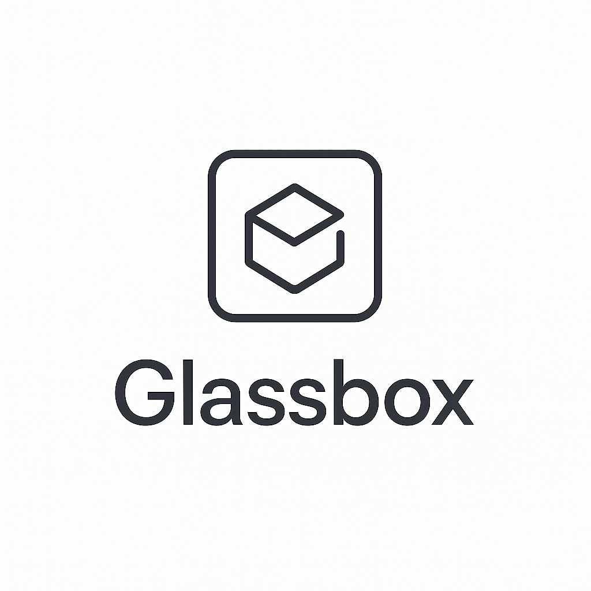

# 🔍 Glassbox - Advanced LLM Debugger

<div align="center">
  
  
  **Advanced debugging and visualization tools for large language models**
  
  [](http://localhost:3000)
  [](http://localhost:8000)
  [](LICENSE)
</div>

---

## ✨ **What is Glassbox?**

Glassbox is a powerful debugging platform that provides **real-time visualization** and **analysis** of large language model behavior. Perfect for researchers, developers, and AI engineers who need to understand how their models think.

### 🎯 **Key Features**

- **🔥 Attention Heatmaps** - Visualize where your model focuses during generation
- **🗺️ Token Embeddings** - 2D projections (PCA/t-SNE) of high-dimensional token representations  
- **📊 Probability Analysis** - Real-time softmax probabilities with information theory metrics
- **⚡ Session Caching** - Fast timeline scrubbing with `past_key_values` optimization
- **🎛️ Interactive Controls** - Click any token to jump through the generation timeline
- **🔄 Real-time Updates** - Live visualization as tokens are generated

---

## 🚀 **Quick Start**

### **Prerequisites**
- Python 3.8+
- Node.js 16+
- 8GB+ RAM (for GPT-2 Large)

### **1. Clone & Setup**
```bash
git clone <your-repo>
cd Glassbox

# Install backend dependencies
cd backend
pip install -r requirements.txt

# Install frontend dependencies  
cd ../frontend
npm install
```

### **2. Start Servers**

**Easy Start (Windows):**
```bash
# Double-click either file
start_servers.bat      # Batch file
start_servers.ps1      # PowerShell script
```

**Manual Start:**
```bash
# Terminal 1 - Backend
cd backend
python app.py

# Terminal 2 - Frontend  
cd frontend
npm start
```

### **3. Open Application**
- Frontend: http://localhost:3000
- Backend API: http://localhost:8000

---

## 📖 **How to Use**

### **🎯 Step 1: Enter a Prompt**
```
In quantum physics, the principle of superposition states that particles can exist in multiple states simultaneously until observed. Similarly, machine learning models process information through layered transformations, where each layer builds upon the previous one to create increasingly complex representations. The fascinating connection between these concepts
```

### **🔄 Step 2: Generate & Analyze**
1. Click **"TRACE GENERATION"**
2. Watch real-time token generation
3. Explore 4 visualization tabs:
   - **Heatmap**: Attention patterns between tokens
   - **Probabilities**: Top token candidates with confidence scores
   - **Analysis**: Information theory metrics and statistics
   - **Embeddings**: 2D projections of token representations

### **🎛️ Step 3: Interactive Exploration** 
- **Click any token** in embeddings to jump to that position
- **Hover over heatmap cells** to see attention values
- **Scrub through timeline** to see how attention evolves
- **Switch between PCA/t-SNE** projections

---

## 🏗️ **Architecture**

### **Backend (`/backend`)**
- **FastAPI** server with async processing
- **GPT-2 Large** model loading and inference
- **Session caching** with `past_key_values` for performance
- **Top-K optimization** for attention matrix compression
- **Real vocabulary mapping** for accurate probability analysis

### **Frontend (`/frontend`)**
- **React + TypeScript** for type safety
- **D3.js** for interactive visualizations
- **Framer Motion** for smooth animations
- **Material-UI** components
- **Session management** with real-time updates

### **Key Technologies**
```
Backend:  FastAPI + PyTorch + Transformers + NumPy
Frontend: React + TypeScript + D3.js + Framer Motion
Model:    GPT-2 Large (774M parameters)
Caching:  In-memory sessions with past_key_values
```

---

## 📊 **Visualization Guide**

### **🔥 Attention Heatmap**
- **Rows**: Source tokens (what's paying attention)
- **Columns**: Target tokens (what's being attended to)
- **Colors**: Blue (low) → Orange/Red (high attention)
- **Current Token**: Green border with pulsing effect

### **🗺️ Token Embeddings**
- **Yellow dots**: Prompt tokens
- **Teal dots**: Generated tokens  
- **Orange dot**: Current token position
- **Lines**: Sequential token connections
- **Clustering**: Similar tokens appear closer together

### **📊 Probability Bars**
- **Bar Height**: Probability of each token
- **Colors**: Gradient from low to high probability
- **Metrics**: Confidence %, logit values, bits surprised
- **Interactive**: Click to jump to any token

---

## ⚙️ **Advanced Configuration**

### **Model Settings**
```python
# In backend/app.py
MAX_NEW_TOKENS = 20        # Tokens to generate
TOP_K_ATTENTION = 10       # Top attention heads to keep
TOP_K_TOKENS = 20          # Top tokens to show in probabilities
```

### **Performance Tuning**
```python
# Memory optimization
torch.cuda.empty_cache()   # Clear GPU memory
model.half()               # Use 16-bit precision
```

---

## 🔮 **Future SaaS Roadmap**

Glassbox is designed for easy transformation into a scalable SaaS platform:

### **Phase 1: Infrastructure** 
- Microservices architecture
- Multi-user authentication  
- Cloud deployment (AWS/GCP)

### **Phase 2: Advanced Features**
- Multiple model support (GPT-3, LLaMA, etc.)
- Real-time collaboration
- Custom model uploads

### **Phase 3: Enterprise**
- API access
- White-label solutions
- Advanced analytics

*See `SAAS_ROADMAP.md` for complete transformation plan.*

---

## 🤝 **Contributing**

We welcome contributions! Here's how to get started:

1. **Fork the repository**
2. **Create a feature branch** (`git checkout -b feature/amazing-feature`)
3. **Commit changes** (`git commit -m 'Add amazing feature'`)
4. **Push to branch** (`git push origin feature/amazing-feature`)
5. **Open a Pull Request**

### **Development Setup**
```bash
# Backend development
cd backend
pip install -r requirements-dev.txt
python -m pytest

# Frontend development  
cd frontend
npm run test
npm run lint
```

---

## 📄 **License**

This project is licensed under the MIT License - see the [LICENSE](LICENSE) file for details.

---

## 🆘 **Support**

- **Issues**: [GitHub Issues](https://github.com/your-username/glassbox/issues)
- **Discussions**: [GitHub Discussions](https://github.com/your-username/glassbox/discussions)
- **Email**: support@glassbox.ai

---

## 🙏 **Acknowledgments**

- **Hugging Face Transformers** for model infrastructure
- **OpenAI GPT-2** for the base model
- **D3.js Community** for visualization inspiration
- **React Team** for the amazing framework

---

<div align="center">
  
  
  **Made with ❤️ by the Glassbox Team**
  
  *Bringing transparency to AI, one token at a time.*
</div> 